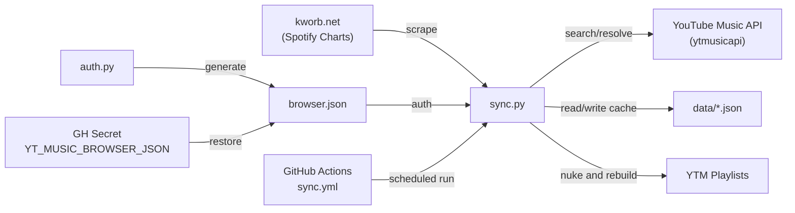

# 🔍 ytmusic-sync — Full Project Audit

> Audited: 2026-07-01 | Repo: [github.com/quantavil/ytmusic-sync](https://github.com/quantavil/ytmusic-sync)

---

## 📊 Project Stats

| Metric | Value |
|:---|:---|
| Total source files | 7 (excluding `.venv`, `data/`, creds) |
| Total lines of code | **726** |
| Python source | 541 lines (sync.py 436 + auth.py 105) |
| Commits | 2 |
| Working tree | Clean (no uncommitted changes) |
| Dependencies | 3 (`ytmusicapi`, `requests`, `beautifulsoup4`) |

---

## 🏗️ Architecture Overview



---

## ✅ What's Good

| Area | Details |
|:---|:---|
| **Single-file simplicity** | All core logic in one 436-line script. Easy to read, debug, deploy. |
| **Smart caching** | Two-tier cache (Spotify ID → YT ID, Artist+Title → YT ID) avoids redundant API searches across runs. |
| **Retry logic** | HTTP scraping has 3 retries with backoff. |
| **Rate-limit awareness** | Random 0.3–0.8s delay between YT Music searches. |
| **Chunked uploads** | Playlist additions batched in 50-track chunks. |
| **Auth auto-detection** | Prefers `browser.json` over `oauth.json` automatically. |
| **Clean .gitignore** | Credentials and cache properly excluded. |
| **CI/CD ready** | GitHub Actions workflow with `workflow_dispatch` for manual runs. |
| **Good README** | Clear setup instructions, CLI docs, and secret configuration guide. |

---

## 🐛 Bugs

### 1. `browser.json` cookie expiry will silently break CI

Browser cookies expire every ~1–2 years (sometimes sooner if Google rotates sessions). When they expire, the GitHub Actions workflow will fail silently or throw cryptic auth errors with no notification mechanism.

**Fix:** Add error handling around `YTMusic()` initialization that catches auth failures and exits with a clear error code + message. Consider adding a notification step (e.g., GitHub issue, email) on workflow failure.

### 2. No validation that `add_playlist_items` succeeded

`sync.py:424` — `yt.add_playlist_items(playlist_id, chunk)` return value is never checked. If a chunk partially fails (e.g., some video IDs are invalid/deleted), the script won't know.

### 3. `parse_num` defined inside loop scope

`sync.py:190-192` — `parse_num()` is defined inside the `for r_idx in range(...)` loop body. Python re-creates the function object on every iteration. Harmless but wasteful — should be moved outside.

### 4. Scraper depends on Kworb's exact HTML structure

The column-detection logic (`sync.py:114-142`) tries header matching but has hardcoded fallback indices. If Kworb adds/removes a column, the fallback indices will silently map to wrong data (e.g., streams ↔ peak swap).

---

## ⚠️ Issues & Improvements

### 5. Dead OAuth code path

The OAuth path in `auth.py:44-99` and `sync.py:285-294` is documented as **broken/unstable**. It adds ~60 lines of code that can't actually work. Consider removing it entirely and simplifying.

### 6. No error handling on playlist creation failure

`sync.py:388-393` — `yt.create_playlist()` can return an error string instead of a playlist ID. No validation that `playlist_id` is a valid ID before proceeding.

### 7. Workflow runs daily but syncs weekly data

The README title says "Spotify **Weekly** Charts" and the cron runs **daily** at `03:50 UTC`. This means 6 out of 7 runs will nuke-and-rebuild the exact same playlist with the same data, which is wasteful API usage.

**Suggestion:** Add a check comparing `weekDate` from the scraped data against the cached `data/{country}.json`. Skip sync if the week hasn't changed.

### 8. No concurrency guard in CI

If two workflow runs overlap (manual trigger + scheduled), both could nuke the same playlist simultaneously. Add `concurrency` to the workflow:

```yaml
concurrency:
  group: ytmusic-sync
  cancel-in-progress: true
```

### 9. Missing `lxml` for faster parsing

`BeautifulSoup` defaults to Python's built-in `html.parser`. Adding `lxml` to requirements and passing `"lxml"` to BeautifulSoup would be faster, but this is minor for 200 rows.

### 10. Hardcoded 200-track limit

`sync.py:148` — `if len(tracks) >= 200: break` is hardcoded. Should be a CLI argument or constant at the top of the file.

---

## 🔒 Security

| Check | Status |
|:---|:---|
| Credentials in `.gitignore` | ✅ `oauth.json`, `browser.json` excluded |
| No hardcoded secrets in source | ✅ Clean |
| GitHub secret for CI | ✅ `YT_MUSIC_BROWSER_JSON` |
| `data/` excluded from git | ✅ |
| Git history clean of secrets | ✅ (2 commits, verified) |

---

## 📁 File-by-File Review

### `sync.py` — 436 lines
The core script. Does 4 things in one `main()`:
1. Scrapes Kworb HTML table
2. Resolves tracks to YTMusic IDs (with cache)
3. Finds or creates target playlist
4. Nuke & rebuild

**Verdict:** Solid for a single-purpose script. Would only refactor if adding more charts or features.

### `auth.py` — 105 lines
Interactive CLI for auth setup. Option 1 (browser) works. Option 2 (OAuth) is documented as broken.

**Verdict:** Consider removing Option 2 entirely to avoid confusion.

### `.github/workflows/sync.yml` — 38 lines
Clean workflow. Uses `actions/checkout@v4`, `setup-python@v5`, `astral-sh/setup-uv@v3`.

**Verdict:** Missing `concurrency` guard and failure notifications. Otherwise solid.

### `requirements.txt` — 3 lines
Minimal. Pinned with `>=` lower bounds. Fine for this project.

### `README.md` — 96 lines
Clear, well-structured. Covers setup, usage, CLI args, and CI configuration.

### `MEMORY.md` — 34 lines
Good project memory doc. Blunders section captures the OAuth 400 issue.

### `.gitignore` — 14 lines
Correct. Covers credentials, venv, cache, pycache.

---

## 📋 Prioritized Action Items

| Priority | Item | Effort |
|:---|:---|:---|
| 🔴 High | Add skip-if-same-week check to avoid 6 redundant nuke-rebuilds per week | 15 min |
| 🔴 High | Add `concurrency` group to workflow | 2 min |
| 🟡 Medium | Validate `create_playlist` / `add_playlist_items` return values | 10 min |
| 🟡 Medium | Remove dead OAuth code path from `auth.py` and `sync.py` | 10 min |
| 🟡 Medium | Move `parse_num` out of loop | 1 min |
| 🟢 Low | Make track limit configurable via CLI arg | 5 min |
| 🟢 Low | Add workflow failure notification | 10 min |

---

## 🏆 Overall Score

| Category | Score |
|:---|:---|
| Functionality | ⭐⭐⭐⭐ (works, but untested edge cases) |
| Code Quality | ⭐⭐⭐⭐ (clean, readable, minor nits) |
| Security | ⭐⭐⭐⭐⭐ (no leaked secrets) |
| CI/CD | ⭐⭐⭐ (works but missing guards) |
| Documentation | ⭐⭐⭐⭐ (thorough README + MEMORY) |
| **Overall** | **⭐⭐⭐⭐ / 5** |

> The highest-impact improvement is the **skip-if-same-week** check — it would eliminate ~85% of unnecessary API calls and make the daily cron schedule truly efficient.
